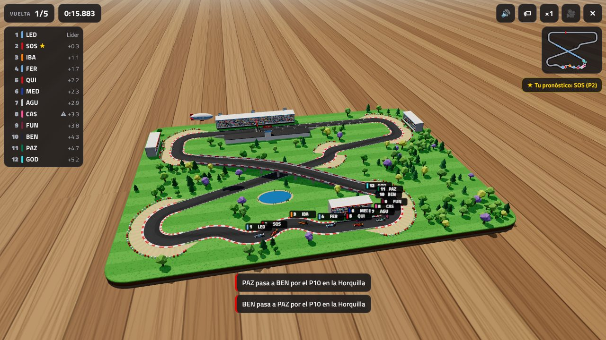
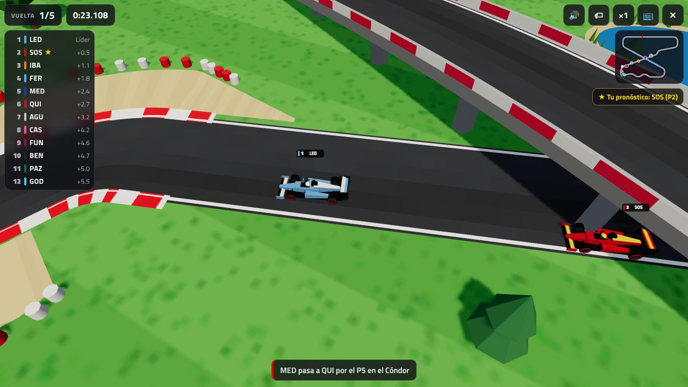

# F1 AR · Gran Premio en realidad aumentada

Juego web en **realidad aumentada** (WebXR): apuntás el celular a una mesa o al
piso, el autódromo se **construye solo** sobre el terreno (la asfaltadora va
tirando la pista, después crecen los árboles, se arman las tribunas y llega el
público) y al final los autos salen a la grilla y **simulan una carrera** completa.
Antes de largar elegís **quién creés que va a ganar**.

Todo es 3D (Three.js): autos de F1 con alerones, ruedas, halo y casco, tribunas
con cientos de personas que festejan cuando pasan los autos, árboles, boxes,
pórtico con semáforo, barreras de gomas, laguna y un dirigible.




## Cómo se juega

1. Elegí vueltas (3–12), cantidad de autos (8–20) y si hay incidentes.
2. **Jugar en AR**: mové el teléfono despacio hasta que aparezca el aro sobre la
   mesa o el piso. Ajustá el tamaño (0,4 m a 4 m), girá si querés y tocá la
   pantalla para colocar el autódromo.
   **Jugar en 3D**: lo mismo, pero en pantalla (para compus o iPhone).
3. Mirá cómo se arma el circuito (con **⏩ Acelerar** va más rápido).
4. **¿Quién creés que gana?** Tocá a tu piloto en la grilla y apretá
   **🚦 ¡Largar!**. Se encienden las 5 luces rojas… y largan.
5. Durante la carrera:
   - Tabla de posiciones en vivo (tocá un piloto para seguirlo y ver su ficha:
     velocidad, diferencia, vueltas).
   - Minimapa, mensajes de adelantamientos, trompos, abandonos y vuelta rápida.
   - 🔊 sonido · 🏷 etiquetas · ×1/×2/×4 velocidad · 🎥 cámaras (libre, TV y
     detrás del auto, solo en 3D).
   - En AR, acercá el teléfono a la pista: los motores suenan más fuerte.
6. Al final: podio, tabla con tiempos y puntos, y si acertaste tu pronóstico
   (se guarda tu historial de aciertos).

## El circuito: Autódromo del Puente

Diseñado a medida: una **figura en 8** de ~870 m con un **puente** donde la
pista se cruza a sí misma (como Suzuka).

| Curva | Qué es |
| --- | --- |
| La Horquilla | Doble curva lenta al final de la recta principal, con leca y gomas |
| El Puente | La pista sube y cruza por arriba del otro tramo |
| El Mirador | Curva a la derecha en el extremo noroeste |
| Eses del Mate | Cuatro curvas enlazadas, rápidas |
| El Cóndor | Curva cerrada al noreste |
| La Chicana | Izquierda-derecha después de pasar por debajo del puente |
| Curva del Tango | Doble curva lenta que da a la recta principal |

La simulación calcula la **trazada ideal** (afuera–vértice–afuera) y el perfil
de velocidades (frenadas y aceleraciones). Cada auto tiene su ritmo según
escudería, piloto, "forma del día", desgaste de gomas, rebufo y DRS; hay
largadas buenas y malas, adelantamientos por adentro, autos que se pasan de largo,
trompos, roturas de motor y banderas azules a los doblados. Escuderías y
pilotos son ficticios.

## Requisitos

- **AR**: Android con Chrome y [Google Play Services for AR (ARCore)](https://developers.google.com/ar/devices).
  La página tiene que estar en **HTTPS** (GitHub Pages ya lo es).
- **iPhone/iPad**: Safari no soporta WebXR en modo AR, así que se juega en **modo 3D**.
- **3D**: cualquier navegador moderno con WebGL.

## Publicarlo (GitHub Pages)

El repo trae el workflow `.github/workflows/pages.yml`, que publica el sitio
cada vez que se hace push a la rama por defecto.

1. En GitHub: **Settings → Pages → Build and deployment → Source: GitHub Actions**.
2. Hacé un push (o corré el workflow a mano desde **Actions → Publicar en GitHub Pages → Run workflow**).
3. Abrí `https://<tu-usuario>.github.io/<repo>/` desde el celular.

## Probarlo en la compu

No hace falta compilar nada (no hay build): es HTML + módulos JS, con Three.js
incluido en `vendor/`.

```bash
npx serve .            # o: python3 -m http.server 8000
```

y abrí `http://localhost:3000` (modo 3D). Para AR en el teléfono hace falta
HTTPS: usá GitHub Pages, o conectá el celular por USB y hacé
`adb reverse tcp:3000 tcp:3000` para abrir `http://localhost:3000` en el
Chrome del teléfono (localhost cuenta como seguro).

## Estructura

| Archivo | Qué hace |
| --- | --- |
| `index.html`, `css/style.css` | Interfaz (menú, colocación AR, pronóstico, HUD, resultados) |
| `js/main.js` | Arranque, modos AR/3D, animación de construcción, cámaras, eventos |
| `js/track.js` | Definición del circuito, trazada ideal y perfil de velocidades |
| `js/trackMesh.js` | Geometría 3D de la pista (asfalto, pianos, leca, puente, grilla) |
| `js/scenery.js` | Terreno, árboles, tribunas con público, boxes, semáforo, carteles, banderas |
| `js/car.js`, `js/geom.js` | Modelo 3D de los autos |
| `js/race.js` | Simulación de la carrera (semáforo, adelantamientos, tiempos, resultados) |
| `js/ar.js` | Sesión WebXR, hit-test y toques |
| `js/hud.js` | Tabla de posiciones, minimapa, ficha del auto, pronóstico, resultados |
| `js/audio.js` | Sonido sintetizado (motores, semáforo, hinchada) |
| `js/teams.js` | Escuderías y pilotos |

### Armar tu propia pista

En `js/track.js`, cada circuito es un polígono de vértices: cada vértice se
redondea con un arco de radio `r`, y `y` es la altura (para hacer puentes).

```js
vertices: [
  { x: 110, z: 63, r: 16, name: 'la Horquilla' },
  { x: 18, z: -26, r: 400, y: 7.6, name: 'el Puente' },
  // ...
],
start: [30, 63],   // dónde va la línea de largada (con recta detrás para la grilla)
stands: [{ x: 30, z: 84, len: 84, rows: 6, main: true }],  // tribunas
```

## Créditos

- [Three.js](https://threejs.org) (MIT), incluido en `vendor/three`.
- Tipografía Titillium Web (Google Fonts).
